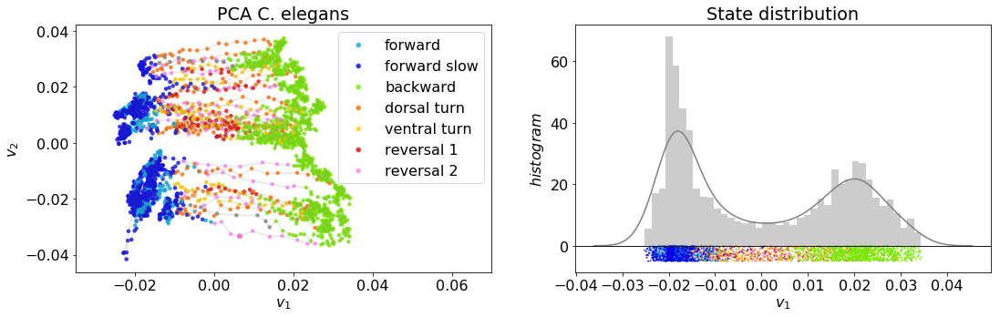

# _C. elegans_ low dimensional activity modeled by a nonlinear dynamical system with control

_C. elegans_ neural activity and its relation to behavior is difficult to characterize as both the dynamics and control are nonlinear. We propose a minimally parameterized nonlinear control model that can be fit to have the same features as those observed in the neural activity data. Nonlinear interpretable models such as this may give us insight into _C. elegans_ dynamics in ways that linear models are unable to due to the intrinsic nonlinearities in the system.

This notebook reproduces select results from the paper "Neuro-sensory integration in the nematode _C. elegans_ as a nonlinear dynamical system with control". More specifically, we implement PCA on the neural activity of a single _C. elegans_ and generate a nonlinear control model with tunable parameters that emulates the _C. elegans_ low dimensional activity.  We compare the state distributions of the data and model and quanitify goodness of fit of the model to the data by calculating the Kullback–Leibler divergence between the probability distribution functions.

## Table of contents
1. [_C. elegans_ dimensionality reduction](#Celegans)
2. [Nonlinear control model](#nonlin_control)
3. [Compare distributions](#compare_dist)

## C. elegans dimensionality reduction 

## Nonlinear control model 

## Compare distributions 

